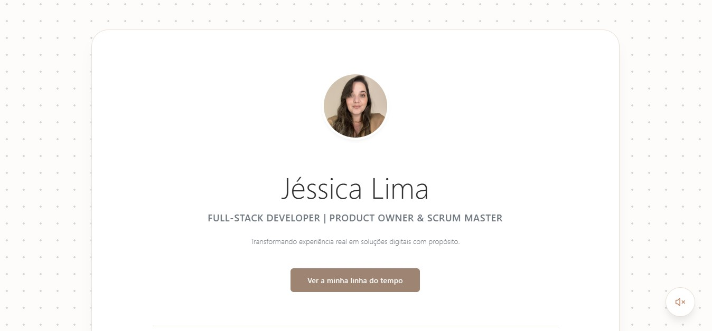
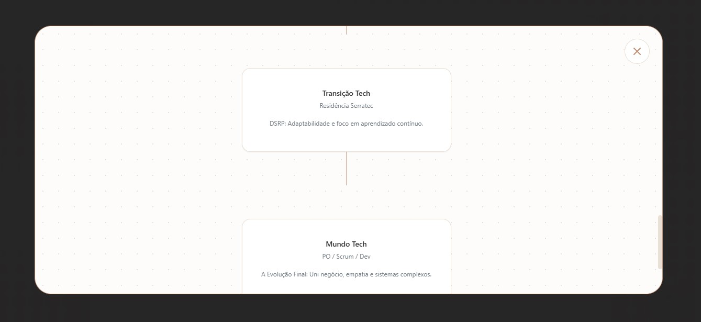
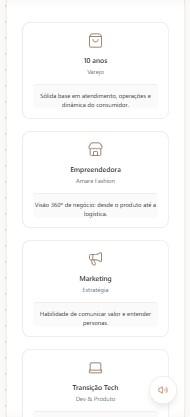

# 🚀 Jéssica Lima | Portfolio One-Page

[🔗 Visualizar Site Ao Vivo](https://jessica-onepage.netlify.app/)
### Full-Stack Developer | Product Owner & Scrum Master


---

## 📸 Preview do Produto

Aqui estão as capturas de ecrã que demonstram o design responsivo e as funcionalidades imersivas do portfólio.

### Visualização Desktop
<p align="center">
  
  <br>
  <em>Seção Hero com Glassmorphism (efeito de vidro) e fundo Canvas Dot Grid.</em>
</p>

### Funcionalidade de Destaque: Mapa Mental de Jornada (Modal)
<p align="center">
  
  <br>
  <em>Ao clicar em 'Ver a minha jornada', um modal imersivo estilo Plectica revela a evolução conectada por fios.</em>
</p>

### Visualização Mobile (Responsivo)
<p align="center">
  
  <br>
  <em>Cards da trajetória empilhados verticalmente e totalmente legíveis no telemóvel.</em>
</p>

---

## 🎯 Visão do Produto
Este não é apenas um portfólio, mas a materialização da minha transição de carreira. O objetivo central foi criar uma experiência imersiva que demonstrasse a união entre a **visão de negócio**, **agilidade** e **desenvolvimento full-stack**.

> "Eu não comecei na tecnologia — eu evoluí até ela."

## ✨ Diferenciais Estratégicos
Ao contrário de currículos estáticos, esta One-Page utiliza conceitos de:
- **DSRP (Systems Thinking):** Cada etapa da minha trajetória é conectada logicamente, mostrando como o varejo e o empreendedorismo alimentam minha capacidade de PO hoje.
- **UX Imersiva:** Uso de Glassmorphism (MainCard) para foco no conteúdo e Canvas Dot Grid para remeter a ferramentas de planejamento (Miro/Plectica).
- **Experiência Sensorial:** Implementação de trilha sonora estratégica (Lo-Fi) com controle de áudio (Mute/Unmute) para foco do usuário.

## 🛠️ Stack Técnica
- **Frontend:** React.js com TypeScript.
- **Estilização:** Styled-Components (CSS-in-JS) para componentes isolados e escaláveis.
- **Animações:** Framer Motion para transições fluidas e micro-interações.
- **Ícones:** Lucide React e React Icons.
- **Arquitetura:** Atomic Design simplificado, focado em alta coesão e baixo acoplamento.

## 📱 Funcionalidades de Destaque
- **Mapa Mental de Jornada:** Um Modal interativo que se abre ao clique, revelando a linha do tempo conectada por fios (Plectica style).
- **Fluxo de Valor:** Seção visual que demonstra meu mindset de PO: do Utilizador ao Backlog.
- **Totalmente Responsivo:** Design adaptado para todos os dispositivos, garantindo legibilidade e performance.

## 🚀 Como rodar o projeto
1. Clone o repositório:
   ```bash
   git clone [https://github.com/jessicaccl/jessica-lima-onepage.git](https://github.com/jessicaccl/jessica-lima-onepage.git)

2. Instale as dependências:  
    ```bash
    npm install

3. Inicie o servidor de desenvolvimento:
    ```bash
    npm run dev 

📄 Licença
Este projeto foi desenvolvido por Jéssica Lima. Sinta-se à vontade para usar como inspiração!    

